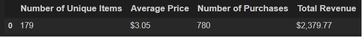
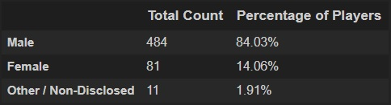
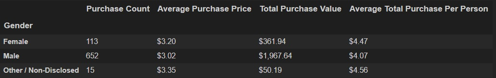
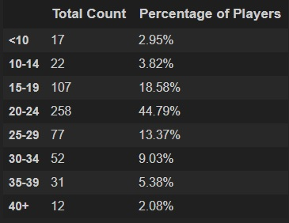
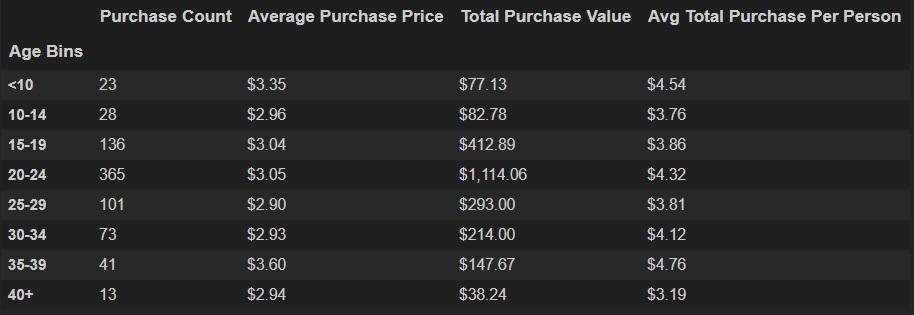
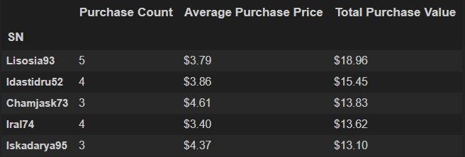
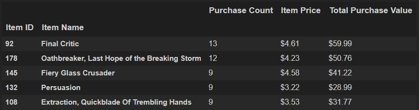
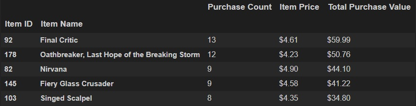

# Heroes of Pymoli

---
---
## Background
This Jupyter Notebook contains a high level purchasing analysis of digital items within the fictional video game "Heroes of Pymoli". The data source (.csv) may be referenced in the available 'Resources' folder. 
---
---
## Player Count

* Total Number of Players: 576

---
## Purchasing Analysis (Total)

* Number of Unique Items
* Average Purchase Price
* Total Number of Purchases
* Total Revenue

---
## Gender Demographics

* Percentage and Count of Male Players
* Percentage and Count of Female Players
* Percentage and Count of Other / Non-Disclosed

---
## Purchasing Analysis (Gender)

The below each broken by gender

* Purchase Count
* Average Purchase Price
* Total Purchase Value
* Average Purchase Total per Person by Gender

---
## Age Demographics

The below each broken into bins of 4 years (i.e. <10, 10-14, 15-19, etc.)

* Purchase Count
* Average Purchase Price
* Total Purchase Value
* Average Purchase Total per Person by Age Group

---
## Top Spenders

Identify the the top 5 spenders in the game by total purchase value, then list (in a table):

* Screen Name
* Purchase Count
* Average Purchase Price
* Total Purchase Value

---
## Most Popular Items

Identify the 5 most popular items by purchase count, then list (in a table):

* Item ID
* Item Name
* Purchase Count
* Item Price
* Total Purchase Value

---
## Most Profitable Items

Identify the 5 most profitable items by total purchase value, then list (in a table):

* Item ID
* Item Name
* Purchase Count
* Item Price
* Total Purchase Value

---
## Observations & Recommendations

* A majority of our players and subsequently revenue generation is from the 20-29 age demo
    * Maintain general marketing level (age 20-29)
    * Push popular items
---
---
* Mid-Career professionals (age demo 35-39) are spending more per item
    * Marketing growth target demographic (age 35-39)
    * Push popular items
---
---
* A majority of our players are male and thus the primary revenue generation demographic
    * Maintain general marketing level (Male)
    * Marketing growth target (Female Demographic) / Higher spend per item
    * Push popular items